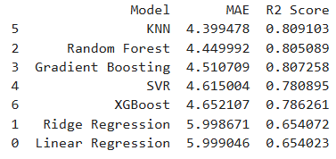
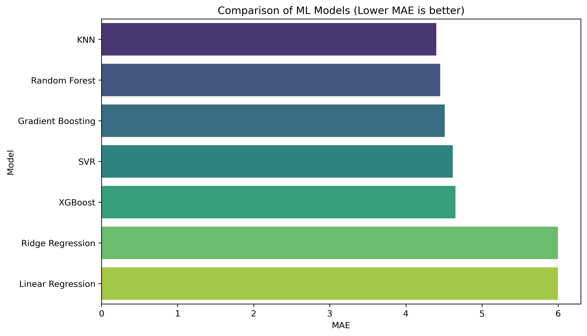

# Data Generation using Modelling and Simulation for Machine Learning

## Project Overview
This project demonstrates the integration of discrete-event simulation with predictive machine learning. The primary objective is to generate synthetic data representing a real-world queueing system (an ATM/Bank branch) and evaluate the capability of various machine learning algorithms to model the underlying system behavior.

## Methodology
The project follows a structured six-step pipeline to move from a conceptual simulation to a comparative analysis of machine learning models.

### 1. Simulation Environment
The simulation is built using the **SimPy** library in Python. It models a queueing system where customers arrive according to a Poisson process and are served by a finite number of resources (ATMs).

### 2. Parameters and Bounds
The dataset was generated by varying three key input parameters within defined stochastic boundaries:
* **Arrival Rate (λ):** Range [0.5, 5.0].
* **Service Time (μ):** Range [1.0, 10.0].
* **Number of ATMs:** Range [1, 5].

### 3. Data Generation
A total of 1,000 unique simulation runs were conducted. In each run, random parameters were sampled, the simulation was executed for 100 time units, and the Average Wait Time was recorded.

## Machine Learning Analysis
Seven distinct regression models were implemented and compared to determine which architecture best captures the dynamics of the queueing simulation.

### Model Performance Metrics
Below is the comprehensive comparison of the models based on Mean Absolute Error (MAE) and R2 Score:

### Visualization of Accuracy
The following bar chart illustrates the Mean Absolute Error across all tested models. Lower values indicate higher predictive accuracy.

## Conclusion
Based on the experimental results, the ensemble-based models generally outperformed linear methods, suggesting non-linear interactions between arrival rates and system capacity in the simulation data.

## Instructions for Reproduction
1. Install dependencies: \`pip install simpy scikit-learn pandas numpy matplotlib seaborn xgboost\`
2. Run the Jupyter Notebook cells sequentially.
3. The simulation will generate \`simulation_data.csv\`, \`results_table.png\`, and \`model_comparison.png\`.
